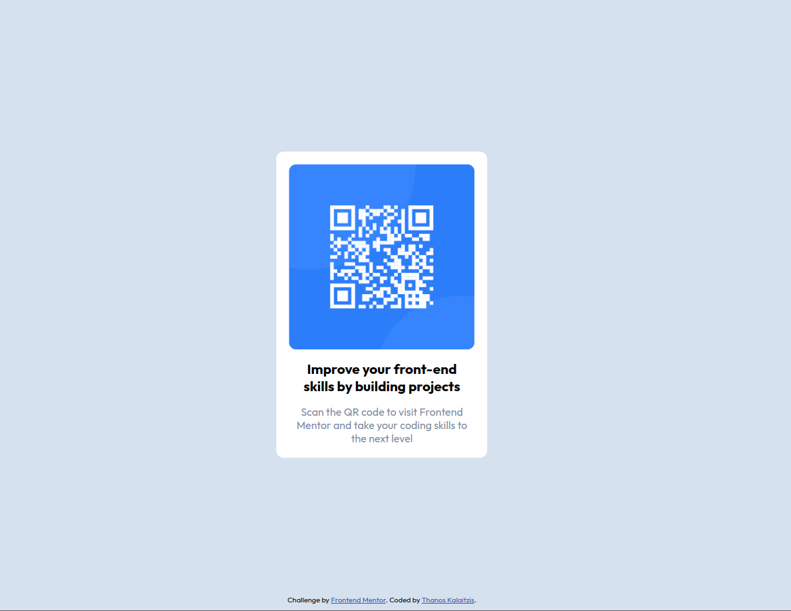

# Frontend Mentor - QR code component solution

This is a solution to the [QR code component challenge on Frontend Mentor](https://www.frontendmentor.io/challenges/qr-code-component-iux_sIO_H). Frontend Mentor challenges help you improve your coding skills by building realistic projects.

## Table of contents

- [Frontend Mentor - QR code component solution](#frontend-mentor---qr-code-component-solution)
  - [Table of contents](#table-of-contents)
  - [Overview](#overview)
    - [Screenshot](#screenshot)
    - [Links](#links)
  - [My process](#my-process)
    - [Built with](#built-with)
    - [What I learned](#what-i-learned)
    - [Continued development](#continued-development)
    - [Useful resources](#useful-resources)
  - [Author](#author)

## Overview

### Screenshot

### Links

- Solution URL: [https://github.com/Thanos-M11/qr-code-component-main](https://github.com/Thanos-M11/qr-code-component-main)
- Live Site URL: [https://thanos-m11.github.io/qr-code-component-main/](https://thanos-m11.github.io/qr-code-component-main/)

## My process

- **HTML**
  - imported the [Outfit](https://fonts.google.com/selection?query=outfit) font family from Google according to `style-guide.md`
  - added a `style.css` file to be linked to the `index.html`
  - inserted a `link` tag related to stylesheet with reference to the `style.css`
  - created a section element with a `container` class that contains a heading tag and a `p` tag.
  - assigned a class of `line-1` and `line-2` to each of child elements of the container.
  - created a footer tag with a class `attribution` as given by the challenger.
- **STYLING**
  - created global color and width variables
  - used a CSS reset from [Josh Comeau](https://www.joshwcomeau.com/css/custom-css-reset/)
  - found the given background color hex code using a tool [imagecolorpicker](https://imagecolorpicker.com/). I had to take a snapshot and upload the screenshot.
  - used a `flex` display in the `container` class and positioned the whole container in the middle of the viewport
  - initialized a git repository
  - committed and pushed files on git
  - deployed the page on [github pages](https://pages.github.com/)

### Built with

- Semantic HTML5 markup
- CSS custom properties
- Flexbox
- Mobile-first workflow

### What I learned

> **_I would like to thank Grace (@grace-snow) for her valuable recommendations which I received from the frontend mentors community as feedback_**

Following her advice I learned:

- not to use the `figure` element on this project because we don't include any `figcaption`
- what `alt` text to be included in an image element
- changed the `p` element of the first bit of text to a heading
- centered the component on the screen using `flexbox` and not `position` property. **Position absolute** removes the component from the normal document flow and breaks on smaller screens!
- did the same with the footer. Included it within a `flexbox` wrapper.
- used a full modern CSS reset from [Josh Comeau](https://www.joshwcomeau.com/css/custom-css-reset/)

### Continued development

- responsive design
- modular css
- pattern libraries
- transitions

### Useful resources

Book: [CSS in Depth by Keith J. Grant](https://www.manning.com/books/css-in-depth-second-edition)

[Josh's Custom CSS Reset](https://www.joshwcomeau.com/css/custom-css-reset/)

## Author

- Website - [Thanos Kalaitzis](https://thanosdev.netlify.app)
- Frontend Mentor - [@Thanos-M11](https://www.frontendmentor.io/profile/Thanos-M11)
- Github - [@Thanos-M11](https://github.com/Thanos-M11)
- LinkedIn - [Thanos Kalaitzis](https://www.linkedin.com/in/thanoskalaitzis/)
